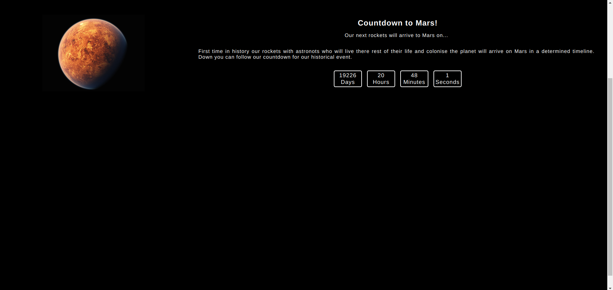

# COUNTDOWN PROJECT

## FULLSTACK PRACTICE PROJECT NO: 12

1. A fullstack version of my previous frontend project to practice my skills using Javascript, Jquery, NodeJS, ExpressJS, HTML, CSS.

2. It is a countdown for a future date including days, hours, minutes and seconds and refreshes every second.

3. I used mathematical formulas for this project and Date().
